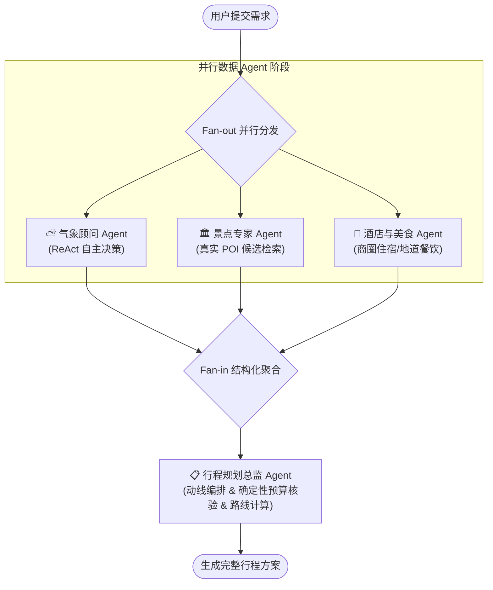

# 🧭 TravelAssistant · 智能旅行助手

<div align="center">

基于 **LangGraph 并行多智能体架构** + **高德地图真实地理数据（MCP / Web API）** 的现代化智能旅行规划系统。

[](https://www.python.org/)
[](https://fastapi.tiangolo.com/)
[](https://github.com/langchain-ai/langgraph)
[](https://vuejs.org/)
[](https://www.typescriptlang.org/)
[](LICENSE)

</div>

---

## 🌟 核心特性

- 🤖 **LangGraph 并行多智能体协同 (Fan-out / Fan-in)**
  - **气象顾问 Agent (ReAct)**：基于真实天气预报自主分析出行气候，输出穿衣指南与晴雨建议。
  - **景点专家 Agent**：结合高德真实 POI 候选池检索，筛选匹配兴趣标签的真实景点，杜绝 LLM 幻觉编造。
  - **酒店与美食 Agent**：基于城市及商圈真实地理数据，优选符合预算与特色偏好的住宿与地道餐厅。
  - **行程规划总监 Agent**：汇聚上游结构化数据（`MultiAgentState`），智能编排每日游玩节奏与雨天室内兜底方案。
- 🗺️ **真实高德地图与地理服务集成**
  - 集成高德 Web 服务与 MCP（Model Context Protocol）标准协议。
  - 自动计算每日景点间的真实路径规划（驾车/步行距离与预估耗时）。
- 💰 **确定性预算计算引擎**
  - 拒绝 LLM 算术幻觉，门票、住宿、餐饮与交通预算由 Python 确定性逻辑精准计算与核验。
- 💻 **现代化交互前端**
  - 基于 **Vue 3 + Vite + TypeScript + Ant Design Vue** 构建。
  - 深度集成高德地图 JS API 2.0，支持行程点位标记、路线连线可视化展示。
  - 支持一键导出高质量 PDF 旅行计划单（基于 jsPDF & html2canvas）。

---

## 🏗️ 系统架构



---

## 📁 目录结构

```text
TravelAssistant/
├── backend/                  # 后端服务（FastAPI + LangGraph）
│   ├── app/
│   │   ├── agents/          # 智能体定义与 Prompt 模板
│   │   ├── api/             # FastAPI 路由与接口 (Trip / POI / Map)
│   │   ├── models/          # Pydantic 数据契约模型
│   │   ├── services/        # 高德 API、MCP、LLM 及 Unsplash 服务
│   │   └── config.py        # 环境变量与系统配置
│   ├── .env.example         # 后端环境变量模板
│   ├── requirements.txt     # Python 依赖清单
│   └── run.py               # 后端启动入口
├── frontend/                 # 前端应用（Vue 3 + TypeScript + Vite）
│   ├── src/
│   │   ├── views/           # 页面视图 (Home 规划表单 / Result 结果展示)
│   │   ├── services/        # 前端 API 封装
│   │   └── types/           # 前端 TypeScript 类型定义
│   ├── .env.example         # 前端环境变量模板
│   ├── package.json         # 前端依赖配置
│   └── vite.config.ts       # Vite 构建配置
├── docs/                     # 架构方案与开发规范文档
├── .gitignore                # Git 忽略配置
├── LICENSE                   # MIT 开源许可证
└── README.md                 # 项目说明文档
```

---

## 🚀 快速上手

### 环境准备

- **Python**: 3.10 或更高版本
- **Node.js**: 18.0 或更高版本
- **高德开放平台账号**:
  - 创建「Web 服务」Key（后端数据检索与路径规划使用）。
  - 创建「Web 端 (JS API)」Key 及安全密钥 Security Code（前端地图渲染使用）。
- **LLM API Key**: 支持 OpenAI、DeepSeek、Moonshot 等任何兼容 OpenAI 规范的模型提供商。

---

### 1. 后端配置与启动

```bash
# 1. 进入后端目录
cd backend

# 2. 创建并激活虚拟环境（推荐）
python -m venv .venv
# Windows:
.venv\Scripts\activate
# Linux / macOS:
# source .venv/bin/activate

# 3. 安装依赖
pip install -r requirements.txt

# 4. 配置环境变量
cp .env.example .env
# 编辑 .env 文件，填入你的 OPENAI_API_KEY 和 AMAP_API_KEY 等必要参数

# 5. 启动后端开发服务器
python run.py
```
后端服务默认运行在：`http://localhost:8000`，接口文档地址：`http://localhost:8000/docs`。

---

### 2. 前端配置与启动

```bash
# 1. 进入前端目录
cd frontend

# 2. 安装依赖
npm install

# 3. 配置环境变量
cp .env.example .env
# 编辑 .env 文件，配置高德地图 JS API Key：
# VITE_AMAP_KEY=你的高德Web端JS_Key
# VITE_AMAP_SECURITY_CODE=你的高德安全密钥Code

# 4. 启动前端开发服务器
npm run dev
```
前端页面默认运行在：`http://localhost:5173`。

---

## ⚙️ 环境变量说明

### 后端配置 (`backend/.env`)

| 变量名 | 必填 | 说明 | 示例值 |
|---|---|---|---|
| `OPENAI_API_KEY` | 是 | 大模型 API 密钥 | `sk-...` |
| `OPENAI_BASE_URL` | 否 | 大模型 API 基础地址（支持各类中转或兼容端点） | `https://api.openai.com/v1` |
| `OPENAI_MODEL` | 否 | 使用的模型名称 | `gpt-4o` / `deepseek-chat` |
| `AMAP_API_KEY` | 是 | 高德开放平台 Web 服务 Key | `a1b2c3...` |
| `LOG_LEVEL` | 否 | 日志输出级别 | `INFO` |

### 前端配置 (`frontend/.env`)

| 变量名 | 必填 | 说明 | 示例值 |
|---|---|---|---|
| `VITE_API_BASE_URL` | 否 | 后端服务请求地址 | `http://localhost:8000` |
| `VITE_AMAP_KEY` | 是 | 高德 Web 端 (JS API) Key | `d4e5f6...` |
| `VITE_AMAP_SECURITY_CODE` | 是 | 高德 Web 端安全密钥 Security Code | `g7h8i9...` |

---

## 📄 开源许可证

本项目基于 [MIT License](LICENSE) 许可开源。
